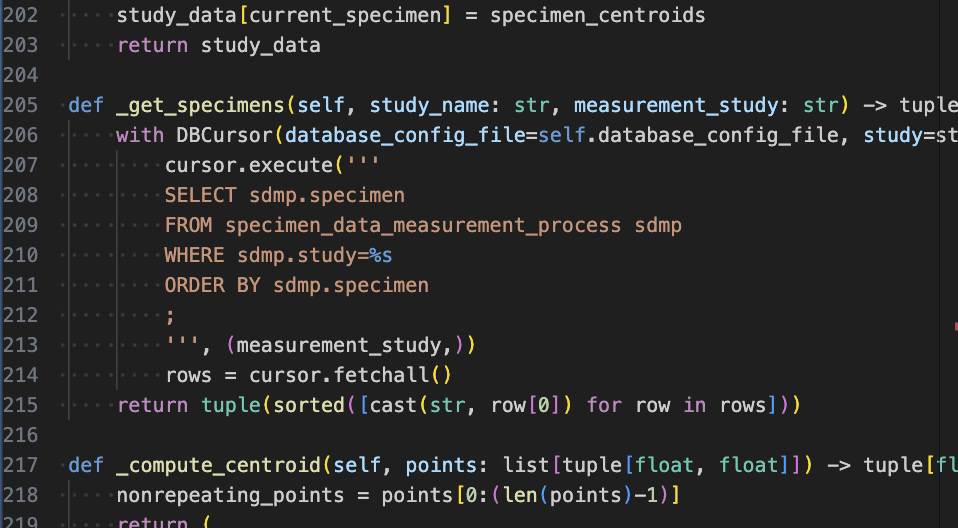
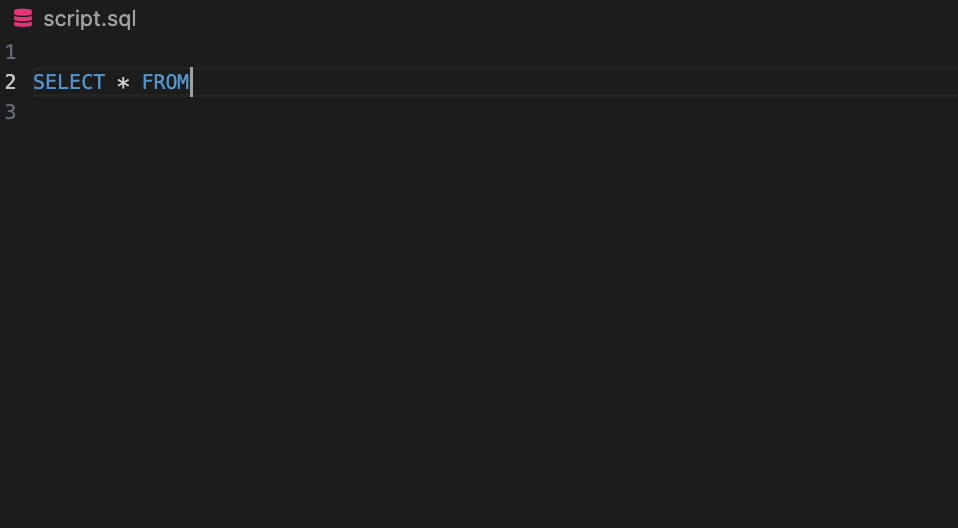
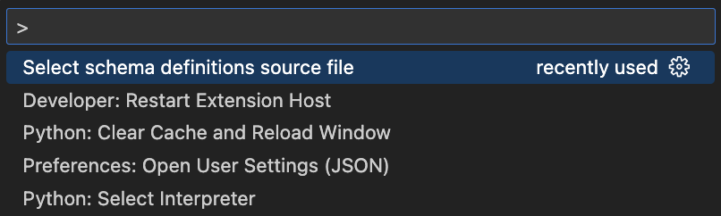

# adi-semantic-highlights

This extension provides tooltips and completions from a given specified relational schema. For the purposes of this extension, a schema is:
- Definitions for entities.
- Definitions for properties.
- List of tables with names.
- List of fields with names.

The schema framework is described in detail here: [https://adiframework.com](https://adiframework.com).

## Features

The tooltips show **full names** and **definitions**, as well as links to external ontologies if annotated in the schema. In this example, a link is provided to [OBI:0000066](https://ontobee.org/ontology/OBI?iri=http://purl.obolibrary.org/obo/OBI_0000066).

Text completions are available for the **vocabulary** of the schema, and specifically **fields** for given entities/table names using dot-notation.

Use the command palette (may be `CMD Shift P` or `Ctrl Shift P`) to select the schema source file or files.

Two formats are supported:
1. SQLite database. (Example: [scstudies.sqlite](https://github.com/nadeemlab/adi-semantic-highlights/raw/refs/heads/main/scstudies.sqlite))
2. TSV files in a subdirectory. (Example: [scstudies/](https://github.com/nadeemlab/adi-semantic-highlights/tree/main/scstudies))

## Settings

The setting `Disable ADI Schema Highlight` is available to turn off all functionality of this extension.

